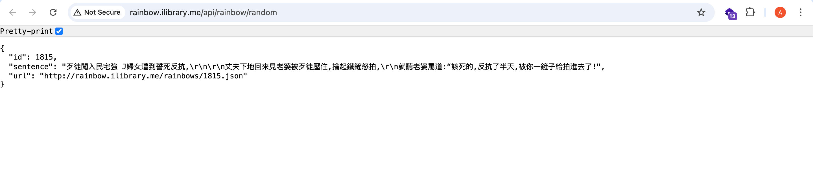
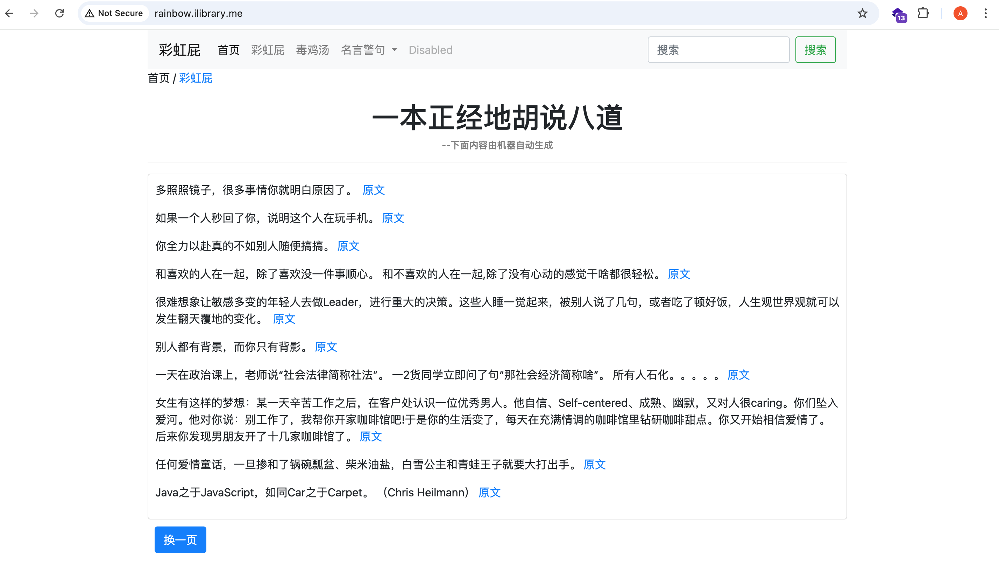
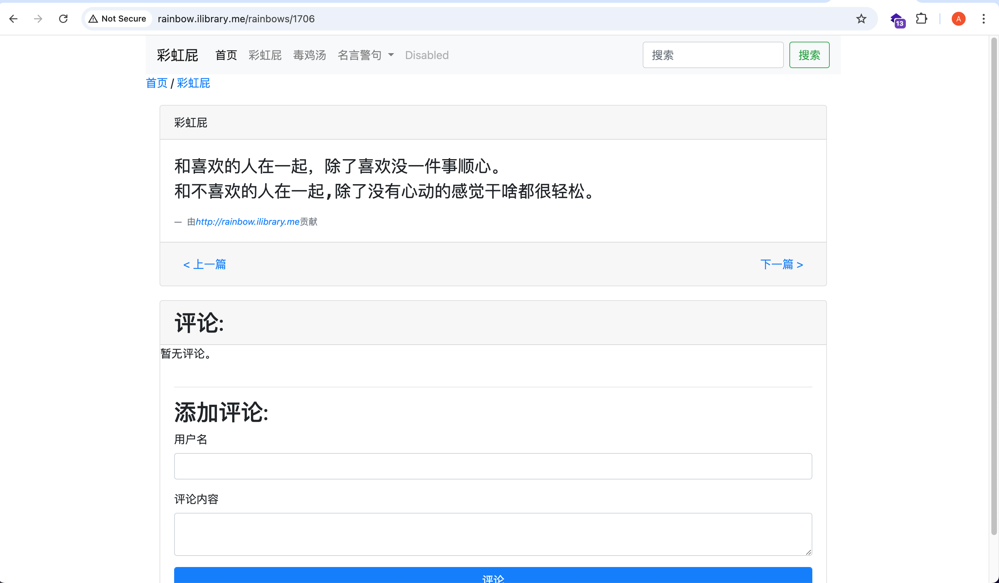
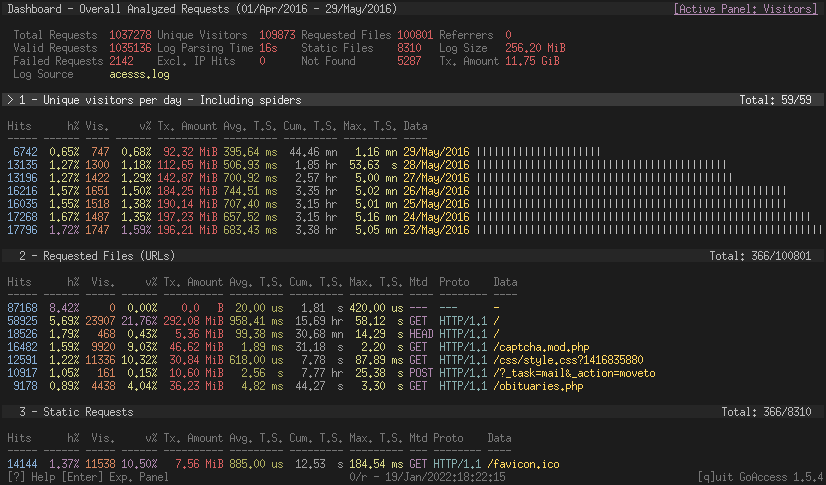
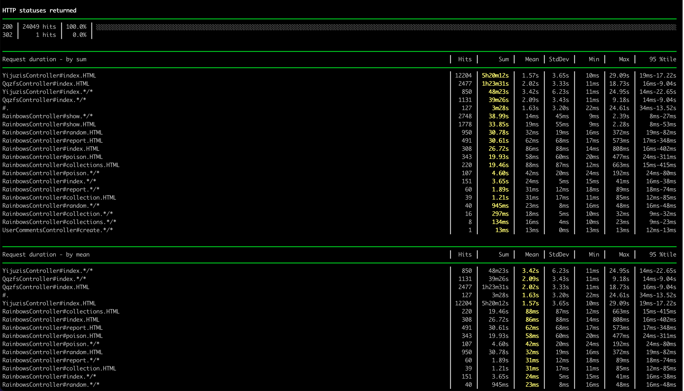

# rainbowfart
彩虹屁网站, 

1. 提供REST API 拉去随机的毒鸡汤, http://rainbow.ilibrary.me/api/rainbow/random
   
1. 也可以网页浏览毒鸡汤, http://rainbow.ilibrary.me/
   
   

彩虹屁站点: http://rainbow.ilibrary.me

api地址: http://rainbow.ilibrary.me/api/rainbow/random

github开源地址: [rainbowfart](https://github.com/younthu/rainbowfart).

该api会随机显示返回一条句子，可能是彩虹屁，可能是毒鸡汤，也可能是心灵鸡汤。

# 集成到网页

本博客的顶部第二行显示的就是从该api获取的动态内容。

目前每次请求都会返回不同的内容。后期考虑通过cookie来实现每5分钟刷新页面内容。

## 静态网页效果代码
下面的代码可以用来集成该api到别的页面, 效果和本博客顶部一样:

~~~html
				

					
					
				

~~~

## 带动效网页代码

本博客顶部用了animated css的动效，下面是加动效后的代码，需要手动添加css的引用:

~~~html
				

					
					<a href="" id="rainbow" style="font-size: 12px;color:cyan">-- 彩虹屁提供</a>
					
				

~~~

animated css cdn, 需要引用下面的代码才会有动效:

~~~html
<head>
  <link rel="stylesheet" href="https://cdnjs.cloudflare.com/ajax/libs/animate.css/3.7.2/animate.min.css">
</head>
~~~

# 集成到命令行

也可以修改shell配置文件，比如我用zsh，直接在`~/.zshrc`里面添加下面的语句:

~~~shell
# say a sentence randomly
echo "*********毒鸡汤**********"
# -e 转义换行和颜色控制,\033[32m 打印绿色字符
echo -e "\033[32m" `curl -s http://rainbow.ilibrary.me/api/rainbow/random | jq '.sentence'`
~~~

主要要手动安装`jq`: `brew install jq`

效果如下:

   
   
   
# Roadmap
1. 添加AI chat支持，以对话的形式搜索想要的毒鸡汤.
   1. [【NLP从零入门】预训练时代下，深度学习模型的文本分类算法（超多干货，小白友好，内附实践代码和文本分类常见中文数据集） 
](https://www.cnblogs.com/lugim/p/16696884.html)
1. 自动爬取鸡汤文，并且继续分类.
2. 
   
# setup

## docker-compose way
master key, credentials使用方法请看 https://blog.engineyard.com/rails-encrypted-credentials-on-rails-5.2 。
1. EDITOR=vim rails credentials:edit
1. environments/production.rb  `config.require_master_key = true`
1. copy config/master.key to server
1. create .env for docker-compose file
    1. put `POSTGRES_PASSWORD` into .env file, it will be used by postgresql and rails
       ~~~sh
       # define env var default value.
       POSTGRES_PASSWORD=xxxxx
       ~~~
1. 生产环境上, nginx在外部容器里, 无法访问rainbow/public目录，导致assets找不到。解决部分有两种:
   1. 添加环境变量`RAILS_SERVE_STATIC_FILES`到rainbow容器, 让rails来提供assets
   1. 把rainbow/public目录mount到nginx的容器下面去

# 加载数据

1. 加载彩虹屁数据
   注意json比较耗数据,
   ~~~shell
   rake import_triple_line_text:import_triple_line_text[db/rainbow_proposal.yml]
   rake import_triple_line_text:import_triple_line_text[db/rainbow.yml]
   rake import_triple_line_text:load_poisonous_soup
   rake import_data:load_qqzf_csv[data/qqzf1.csv]   # 388w条记录，生产环境上SQLite第一次加载用时3108s, 51分钟，在本地postgresl用了40分钟.
   rake import_data:load_1juzi_csv[data/1juzi1.csv] # 12428343条记录
   ~~~
1. 1juzi爬下来的数据分类按category1(大类), category2(小类）来分的。有部分文章是没有category2的
   
# 日志分析

## Nginx log analyzer
[goaccess](https://github.com/allinurl/goaccess)能分析很多日志。 GoAccess is a real-time web log analyzer and interactive viewer that runs in a terminal in *nix systems or through your browser.

1.  https://github.com/allinurl/goaccess
2.  https://goaccess.io/ 
3.  `brew install goaccess`
4.  `apt-get install goaccess`
5.  
## Request log analyzer
[request log analyzer](https://github.com/wvanbergen/request-log-analyzer), This is a simple command line tool to analyze request log files in various formats to produce a performance report. Its purpose is to find what actions are best candidates for optimization.

1. Install ruby: `apt install ruby`
2. Install [request log analyzer](https://github.com/wvanbergen/request-log-analyzer): `gem install request-log-analyzer`
3. Analyze log: `request-log-analyzer log/production.log`
   

# SEO

## 每篇内容都生成独立title
## Breadcrumbs on Rails with Gretel
https://www.sitepoint.com/breadcrumbs-rails-gretel/,
面包屑导航就是一个路径导航, runoob上有[bootstrap4面包屑导航效果](https://www.runoob.com/bootstrap4/bootstrap4-breadcrumb.html)

##参考

1. [给RailsDeveloper的基本SEO](http://gogojimmy.net/2013/09/26/basic-seo-for-rails-developer/)

# 日常维护

## 更新sitemap

1. 在生产环境上运行`rake sitemap:refresh`, 该命令会自动生产新的sitemap.xml.gz然后放public目录下.但是ping google会失败。
1. 在本地运行`hp rake sitemap:refresh`, 通知google sitemap更新了。
1. 从rainbow.ilibrary.me/sitemap.xml.gz下载sitemap文件，可能要经用浏览器缓存才能下到最新的sitemap.

## ActiveAdmin

1. [Mastering ActiveAdmin](http://staal.io/blog/2013/02/26/mastering-activeadmin/)

## Troubleshooting

1. ActionView::Template::Error (The asset "application.css" is not present in the asset pipeline
    先检查是否有正确安装yarn.
    Add env variable RAILS_SERVE_STATIC_FILES to start command,
    [Stackoverflow](https://stackoverflow.com/questions/21969549/rails-application-css-asset-not-found-in-production-mode)
1. `@q.result(distinct: true)` distinct为true时很耗时。查询qqzf387w记录大概要15-20s，去掉以后大概只要0.9s
1. sqlite在数据量大的时候count非常慢, 380w条记录需要58978.9ms，分页查询只要0.8ms. 这对kaminari分页影响比较大.解决办法就是hack ActiveRelation
   ~~~
   a = Qqzf.all
       a.instance_eval do
         def total_count
           3876341
         end
       end
       @qqzfs = a.page(params[:page]).per(25)
   ~~~

# 数据库切换
数据库切换用了 [yaml_db](https://github.com/yamldb/yaml_db), 从sqlite3切换到postgres.

yaml_db的问题
1. 不支持transaction
2. 耗内存。8G的机器直接爆了。
3.

最后还是sqlite dump sql scripts, 手动改sql scripts, 再倒入到psql里面去
1. 导出sqlite数据: ` sqlite3 rainbow_production.sqlite3 .dump > dump.sql`
1. 导出schema: `sqlite3 rainbow_production.sqlite3 .schema > schema.sql`, 这个schema根据自己的实际情况选择用还是不用.
1. put `\set ON_ERROR_STOP on` into `~/.psqlrc`
1. 连接psql: `psql -U postgres -h db -d rainbow`
1. 清除ar_internal_metadata里的内容`delete from ar_internal_metadata`
1. sql scripts清理:
    1. 清空rainbows: `delete from rainbows`
    1. 删除第一行: `sed -i '' -e '1d' data.sql.bak`
    1. 删除重复的索引: `index_user_comments_on_rainbow_id`
    1. 删除data.sql.bak里面末尾sqlite_sequence相关的数据: `sed -i '' '/sqlite_sequence/d' data.sql.bak`
1. 导入数据到psql: `psql -d rainbowfart_dev -U postgres < data.sql.bak`
1. 更新sequence ids:
   需要更新`admin_users`,`rainbows`,`tags`, `taggings`, `active_admin_comments`, `qqzfs`, `yijuzis`, `user_comments`

   设置id_seq如下, 值为当前记录的最大id值:
   ~~~sql
   select setval('taggings_id_seq', 3734, true);
   ~~~

   下面是摘抄自stackoverflow
   ~~~sql
   -- Login to psql and run the following

   -- What is the result?
   SELECT MAX(id) FROM your_table;

   -- Then run...
   -- This should be higher than the last result.
   SELECT nextval('your_table_id_seq');

   -- If it's not higher... run this set the sequence last to your highest id.
   -- (wise to run a quick pg_dump first...)

   BEGIN;
   -- protect against concurrent inserts while you update the counter
   LOCK TABLE your_table IN EXCLUSIVE MODE;
   -- Update the sequence
   SELECT setval('your_table_id_seq', COALESCE((SELECT MAX(id)+1 FROM your_table), 1), false);
   COMMIT;
   ~~~
